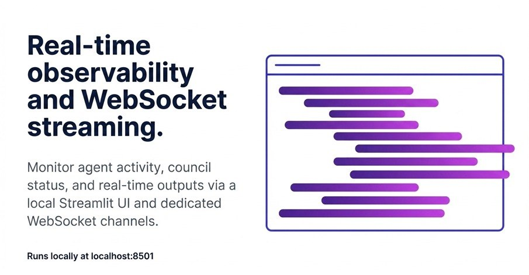
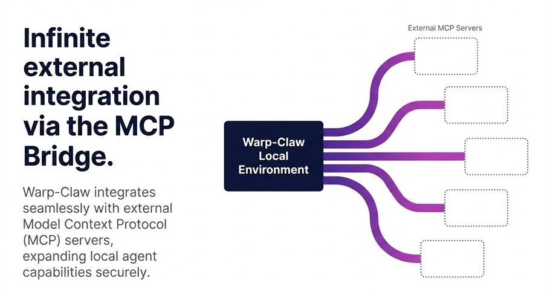

# 🌀 Warp-Claw

> Hybrid infrastructure combining Warp-Cortex with OpenAI-compatible API for local Apple Silicon deployment.

## Why Warp-Claw?

Warp-Claw bridges two powerful systems:
- **Warp-Cortex**: JorgeLRW's multi-agent architecture with River/Stream, Prism weight sharing, and Topological Synapse
- **OpenAI API**: Standard HTTP endpoints compatible with the entire OpenAI ecosystem

Deploy local AI agents with the same tooling you'd use with GPT-4.

## Features

| Feature | Description |
|---------|-------------|
| **Multi-Agent Councils** | Research, Code, Creative, and Meta councils that collaborate in real-time |
| **OpenAI-Compatible API** | Use `openai` Python client, curl, or any OpenAI-compatible tool |
| **M1/MPS Optimization** | Metal Performance Shaders for Apple Silicon |
| **Tool Integration** | Code execution, web search, file system, knowledge graph tools |
| **MCP Bridge** | Connect external Model Context Protocol servers |
| **WebSocket Streaming** | Real-time agent activity streaming |
| **Streamlit Dashboard** | Optional UI for monitoring and interaction |

## Architecture

```
User Request
     │
     ▼
┌────────────────────────────────────────┐
│   OpenAI API Server (:8000)           │
│   /v1/chat/completions                │
│   /v1/agents/spawn                   │
└─────────────────┬────────────────────┘
                  │
      ┌───────────┼───────────┐
      ▼           ▼           ▼
┌──────────┐ ┌────────┐ ┌──────────┐
│ Council  │ │ Tools  │ │WebSocket │
│Orchestr. │ │Execut. │ │ Stream   │
└────┬─────┘ └────┬───┘ └────┬────┘
     │            │
     ▼            ▼
┌─────────────────────────┐
│   M1 Cortex Bridge      │
│   (MPS/CPU)             │
└─────────────────────────┘
```

### System Architecture


The complete system showing:
- **Tool Server** - OpenClaw MCP tools
- **Local Model** - M1/MPS inference
- **Agent Loop** - Thought → Action → Observation cycle

### Component Stack



Layers:
- **OpenAI API** - HTTP interface
- **MCP Bridge** - Tool protocol
- **Tools** - Code, search, files
- **M1 Bridge** - Metal performance
- **Local Model** - Ollama/transformers

### Agent Execution Flow



The agent loop:
1. **Thought** - Model reasons about the task
2. **Action** - Executes tool or generates response
3. **Observation** - Receives result, continues reasoning

## Installation

```bash
# Clone the repo
git clone https://github.com/noobsmoker/warp-claw.git
cd warp-claw

# Create virtual environment
python3 -m venv venv
source venv/bin/activate

# Install dependencies
pip install -r requirements.txt
```

## Quick Start

### 1. Download a Model

```bash
python scripts/download_models.py qwen-0.5b

# Or use M1 setup script
bash scripts/setup_m1.sh
```

### 2. Run the API Server

```bash
python -m src.interfaces.openai_api
```

Server starts at `http://localhost:8000`

### 3. Use with OpenAI Client

```python
import openai

client = openai.OpenAI(
    base_url="http://localhost:8000/v1",
    api_key="not-needed"
)

# Standard chat
response = client.chat.completions.create(
    model="qwen-0.5b",
    messages=[{"role": "user", "content": "Explain quantum computing [VERIFY]"}]
)
print(response.choices[0].message.content)
```

### 4. Spawn a Council

```python
import requests

r = requests.post("http://localhost:8000/v1/agents/spawn", json={
    "prompt": "Design a distributed system",
    "council_types": ["research", "creative", "code"],
    "agent_count": 10
})
council_id = r.json()["council_id"]

# Check status
r = requests.get(f"http://localhost:8000/v1/agents/status/{council_id}")
print(r.json())
```

### 5. Start Dashboard (Optional)

```bash
streamlit run src/dashboard/app.py
```

Dashboard at `http://localhost:8501`

## API Endpoints

| Endpoint | Method | Description |
|----------|--------|-------------|
| `/v1/models` | GET | List available models |
| `/v1/chat/completions` | POST | Chat completion |
| `/v1/completions` | POST | Text completion |
| `/v1/agents/spawn` | POST | Spawn council |
| `/v1/agents/status/{id}` | GET | Council status |
| `/v1/agents` | GET | List agents |

## Configuration

### Models (`config/models.yaml`)

```yaml
models:
  qwen-0.5b:
    repo: "Qwen/Qwen2.5-0.5B-Instruct"
    device: "mps"
    max_agents: 100
    
  qwen-1.5b:
    repo: "Qwen/Qwen2.5-1.5B-Instruct"
    device: "mps"
    max_agents: 50

default_model: "qwen-0.5b"
```

### Agent Councils (`config/agents.yaml`)

```yaml
councils:
  research:
    agent_count: 3
    system_prompt: "You are a fact-checking sub-agent..."
    triggers: ["[SEARCH]", "[VERIFY]"]
    
  code:
    agent_count: 2
    system_prompt: "You are a code review sub-agent..."
    triggers: ["[CODE]", "[REVIEW]"]
```

## Tools

| Tool | Description |
|------|-------------|
| `execute_python` | Run Python code in sandbox |
| `web_search` | Search DuckDuckGo |
| `web_fetch` | Fetch URL content |
| `file_system` | Read/write files |
| `knowledge_graph` | RAG memory store |

## OpenClaw Integration (Option A - Recommended)

Warp-Claw can connect to **OpenClaw** as a tool provider via MCP. This gives your local agents access to OpenClaw's full tool ecosystem without running K8s.

### Architecture

```
┌─────────────────────────────────────────────────┐
│              Warp-Claw (Local)                  │
│  ┌─────────────┐    ┌─────────────────────────┐│
│  │   Agents    │───▶│  OpenClaw MCP Client     ││
│  │  (Local LLM)│    │  src/tools/openclaw_mcp  ││
│  └─────────────┘    └───────────┬─────────────┘│
└─────────────────────────────────┼───────────────┘
                                  │ HTTP/MCP
                                  ▼
┌─────────────────────────────────────────────────┐
│           OpenClaw (Your Server)                │
│  Tool Server (web_search, read_file, etc.)      │
│  Running at: http://localhost:8080              │
└─────────────────────────────────────────────────┘
```

### Setup

```bash
# 1. Start OpenClaw with tool server enabled
openclaw gateway start

# 2. In warp-claw, configure OpenClaw connection
export OPENCLAW_URL="http://localhost:8080"
export OPENCLAW_API_KEY="your-api-key"  # if auth enabled
```

### Usage

```python
from src.tools.openclaw_mcp import OpenClawMCPClient

# Connect to OpenClaw
client = OpenClawMCPClient("http://localhost:8080")
await client.connect()

# Use OpenClaw tools in your agents
result = await client.call_tool("web_search", {"query": "AI agents"})
print(result.result)

# Or use the executor with local fallback
from src.tools.openclaw_mcp import OpenClawToolExecutor

async with OpenClawToolExecutor("http://localhost:8080") as executor:
    # If OpenClaw fails, falls back to local tools
    result = await executor.execute("web_search", {"query": "test"})
```

### Tool Categories Available

When connected to OpenClaw, warp-claw agents get access to:

| Category | Tools |
|----------|-------|
| **Web** | `web_search`, `web_fetch`, `browser` |
| **File** | `read_file`, `write_file`, `glob` |
| **Code** | `execute_command`, `run_tests` |
| **GitHub** | `gh_issues`, `gh_pr`, `gh_actions` |
| **Messaging** | `send_message`, `send_email` |

### Benefits

- **No K8s needed** — Just network connectivity to OpenClaw
- **Local inference** — Models run on your M1/M2/M3
- **OpenClaw tools** — Full tool ecosystem via MCP
- **Fallback** — Local tools work if OpenClaw unavailable

## Makefile Commands

```bash
make help      # Show available targets
make setup    # Install & download models
make test     # Run tests
make run      # Start API server
make dashboard # Start dashboard
make clean   # Clean cache
```

## Docker

```bash
# Build
docker build -t warp-claw:latest .

# Run
docker run -p 8000:8000 -p 8501:8501 warp-claw:latest
```

## Requirements

- Python 3.11+
- Apple Silicon (M1/M2/M3) for MPS support
- Or x86_64 with CPU fallback

## Credits

### Built with OpenClaw
Warp-Claw was built using **[OpenClaw](https://openclaw.ai)** — the AI assistant framework that powers this project. OpenClaw provides:
- Session management and memory
- Multi-channel messaging (Discord, Telegram, webchat, Signal, etc.)
- Tool orchestration and skill system
- Cron scheduling and heartbeats

### Additional Credits

- [Warp-Cortex](https://github.com/JorgeLRW/warp-cortex) - Multi-agent architecture inspiration
- [Qwen](https://github.com/QwenLM/Qwen) - Default models
- [Llama](https://github.com/meta-llama) - Alternative models
- [HuggingFace](https://huggingface.co) - Model hub

## License

MIT

---

⭐ Star us on GitHub if this helps!
